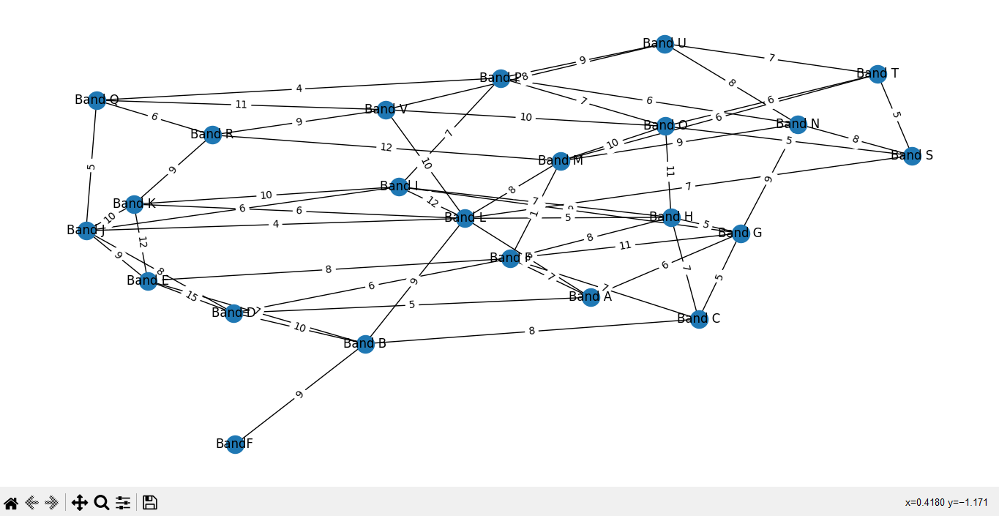
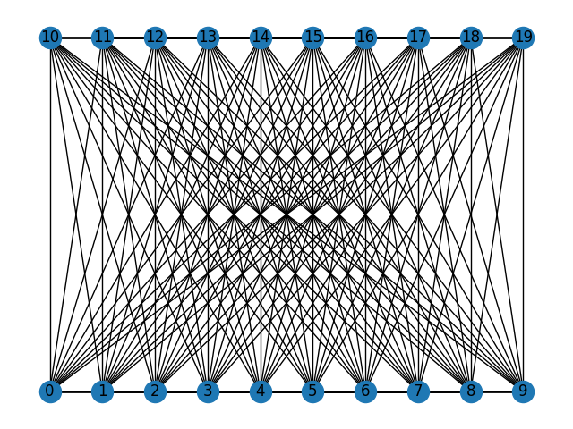
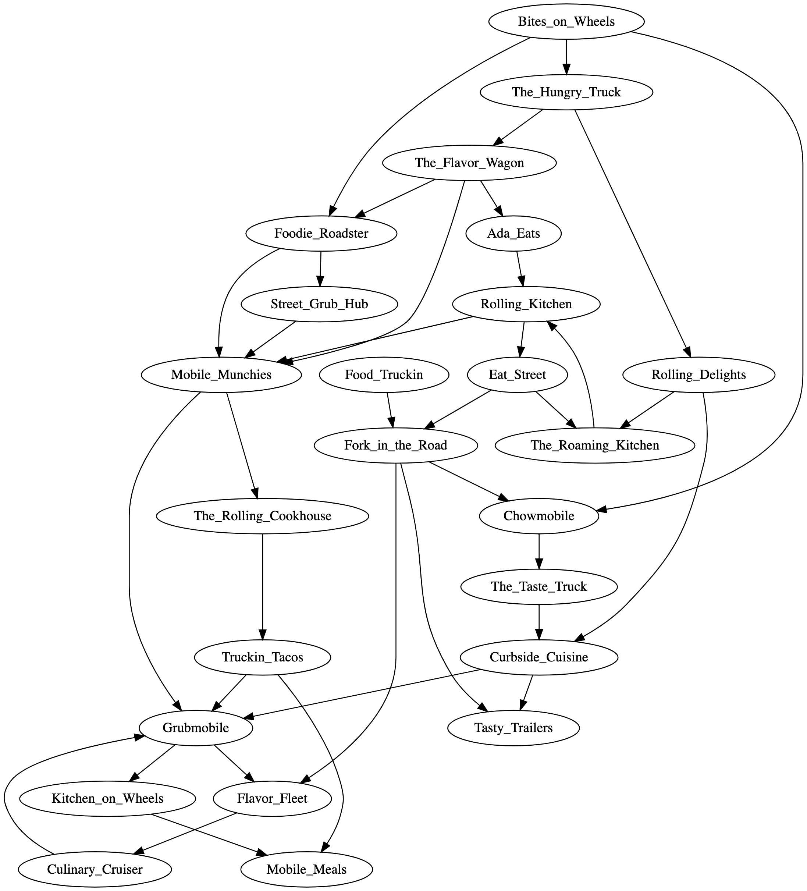

# Band Festivities

**CISC320 Spring 2023 Lesson 14 - Graph Applications**

Group Members:
* Mikaylla Haskins (mikahas@udel.edu)
* Jillian Camp (jillsue@udel.edu)
* Grace O'Leary (goleary@udel.edu)

It's a band festival! There are bands playing at a local park! Each band is named after the alphabet from letters a to v. To get the fullest experience, we've created a map which showcases routes between bands which will allow you to travel to each band within optimal time!

## Installation Code

```sh
$> pip install networkx
import matplotlib.pyplot as plt
import startinggraph.png
```

## Python Environment Setup

```python
import networkx as nx
import matplotlib.pyplot as plt
```

# Band a to Band v

**Minimum spanning tree from band a to band v**: 

> **Formal Description**:
>  * Input: Band Festival Map
>  * Output: Final graph showcasing Minimum Spanning Tree of Band Festival Map

**Graph Problem/Algorithm**: [DFS/BFS/SSSP/APSP/(MST)]


**Setup code**:

# Create an empty graph

```python

G = nx.Graph()

# Add nodes with labels A to V
for i in range(65, 87):
    G.add_node('Band ' + chr(i))

# Add edges to the graph
G.add_edge('Band A', 'Band F', weight=7)
G.add_edge('Band A', 'Band D', weight=5)
G.add_edge('Band B', 'Band C', weight=8)
G.add_edge('Band B', 'BandF', weight=9)
G.add_edge('Band B', 'Band E', weight=7)
G.add_edge('Band C', 'Band G', weight=5)
G.add_edge('Band D', 'Band F', weight=6)
G.add_edge('Band D', 'Band E', weight=15)
G.add_edge('Band E', 'Band F', weight=8)
G.add_edge('Band E', 'Band J', weight=9)
G.add_edge('Band F', 'Band G', weight=11)
G.add_edge('Band F', 'Band H', weight=8)
G.add_edge('Band G', 'Band I', weight=9)
G.add_edge('Band H', 'Band I', weight=7)
G.add_edge('Band H', 'Band L', weight=5)
G.add_edge('Band I', 'Band J', weight=6)
G.add_edge('Band I', 'Band L', weight=12)
G.add_edge('Band J', 'Band K', weight=10)
G.add_edge('Band K', 'Band L', weight=6)
G.add_edge('Band L', 'Band M', weight=8)
G.add_edge('Band M', 'Band N', weight=9)
G.add_edge('Band M', 'Band O', weight=10)
G.add_edge('Band N', 'Band P', weight=6)
G.add_edge('Band O', 'Band P', weight=7)
G.add_edge('Band O', 'Band S', weight=5)
G.add_edge('Band P', 'Band Q', weight=4)
G.add_edge('Band Q', 'Band R', weight=6)
G.add_edge('Band R', 'Band V', weight=9)
G.add_edge('Band S', 'Band T', weight=5)
G.add_edge('Band T', 'Band U', weight=7)
G.add_edge('Band U', 'Band V', weight=8)

# Define edge labels
edge_labels = nx.get_edge_attributes(G, 'weight')
```

**Visualization**:



**Solution code:**

```python

# Compute the minimum spanning tree from node A to V
T = nx.algorithms.tree.minimum_spanning_tree(G.subgraph(nx.node_connected_component(G, 'Band A')), weight='weight')

# Draw the graph and tree

```

**Output**

```python
# plot graph
# Draw the graph and tree
pos = nx.spring_layout(G)
nx.draw(G, pos, with_labels=True)
nx.draw_networkx_edge_labels(G, pos, edge_labels=edge_labels)
plt.show()
pos = nx.spring_layout(G)
nx.draw_networkx_nodes(G, pos, node_color='lightblue')
nx.draw_networkx_labels(G, pos)
nx.draw_networkx_edges(G, pos)
nx.draw_networkx_edges(T, pos, edge_color='red', width=2)
plt.show()


```

**Interpretation of Results**:
These results indicate the optimal routes from each band to get from one band to another with the shortest amount of distance as possible. This graph has accomplished the goal of a minimum spanning tree.


# Is the parade too noisy? (Graph coloring)

**Algorithm: DFS** 

> **Formal Description**:
>  * Input: A graph.
>  * Output: A boolean telling whether or not the graph is bipartite (two-colorable).

**Setup code**

# Create a graph

```python

G = nx.Graph()
G.add_nodes_from(range(20))
for i in range(20):
    for j in range(i+1, 20):
        G.add_edge(i, j)
pos = {i: (i % 10, i // 10) if i < 10 else ((i-10) % 10, (i-10) // 10 + 1) for i in range(20)}
nx.draw(G, pos=pos, with_labels=True)    
plt.show() # show the plot

# Print the graph information
print(nx.info(G))
# Call the function that executes the algorithm on this graph, G. 
print(is_bipartite(G))
```

**Visualization**:


**solution code** 
```python

def is_bipartite(graph):
    """
    Returns True if the given graph is bipartite, and False otherwise.
    """
    # Start DFS from an arbitrary node in the graph
    start_node = next(iter(graph.nodes()))
    visited = {start_node: 0}  # mark the start node as visited and assign it to set 0
    stack = [start_node]

    # Perform DFS while maintaining the visited set and the set assignments
    while stack:
        node = stack.pop()
        node_set = visited[node]

        # Assign the opposite color to all unvisited neighbors
        for neighbor in graph.neighbors(node):
            if neighbor not in visited:
                visited[neighbor] = 1 - node_set
                stack.append(neighbor)
            elif visited[neighbor] == node_set:
                # If a neighbor has the same color as the current node, the graph is not bipartite
                return False

    # If we've visited all nodes without conflicts, the graph is bipartite
    return True
```
**Output**

```python 
True
```

**Interpretation of results**


# Food Truck Fest! 

**Algorithm: BFS** 

> **Formal Description**:
>  * Input: A graph of various food trucks.
>  * Output: A list giving the shortest path to take to get from the food truck Bites on Wheels to the food truck Truckin Tacos


## Python Environment Setup

# Create __main__.py file
 
from _bfs import Bfs

bfs = Bfs()
bfs.run()

# Create _bfs.py file

import networkx as nx

import random

# Create a graph

```in the _bfs.py file
class Bfs:
    def __init__(self) -> None:
        self.foodTruckMap = None

    def run(self) -> None:
        '''
        Make a graph which finds the shortest path using the bfs algorithm...
        There are a bunch of food trucks and you want to find the shortest path from Bites on Wheels to Truckin Tacos.
        '''
        self.foodTruckMap = nx.Graph()
        '''The food trucks'''
        foodTrucks = [
            'Bites on Wheels','The Hungry Truck','Rolling Delights','Foodie Roadster','The Flavor Wagon','Street Grub Hub',
            'Mobile Munchies','Ada Eats','The Roaming Kitchen','Curbside Cuisine','Chowmobile','The Taste Truck','Rolling Kitchen','Food Truckin','Fork in the Road',
            'Eat Street','Tasty Trailers','Grubmobile','Flavor Fleet','Culinary Cruiser',
            'Kitchen on Wheels','Mobile Meals','The Rolling Cookhouse','Truckin Tacos'
        ]

        edges= [
                ("Bites on Wheels" , "The Hungry Truck", {"distance": random.randint(1,10)}), 
                ("Bites on Wheels" , "Foodie Roadster", {"distance": random.randint(1,10)}),
                ("The Hungry Truck" , "The Flavor Wagon", {"distance": random.randint(1,10)}),
                ("The Hungry Truck" , "Rolling Delights", {"distance": random.randint(1,10)}),
                ("Foodie Roadster" , "Street Grub Hub", {"distance": random.randint(1,10)}),
                ("Foodie Roadster" , "Mobile Munchies", {"distance": random.randint(1,10)}),
                ("The Flavor Wagon" , "Mobile Munchies", {"distance": random.randint(1,10)}),
                ("The Flavor Wagon" , "Foodie Roadster", {"distance": random.randint(1,10)}),
                ("The Flavor Wagon" , "Ada Eats", {"distance": random.randint(1,10)}),
                ("Ada Eats" , "Rolling Kitchen", {"distance": random.randint(1,10)}),
                ("Rolling Delights" , "The Roaming Kitchen", {"distance": random.randint(1,10)}),
                ("Rolling Delights" , "Curbside Cuisine", {"distance": random.randint(1,10)}),
                ("Bites on Wheels" , "Chowmobile", {"distance": random.randint(1,10)}),
                ("Chowmobile" , "The Taste Truck", {"distance": random.randint(1,10)}),
                ("The Taste Truck" , "Curbside Cuisine", {"distance": random.randint(1,10)}),
                ("The Roaming Kitchen" , "Rolling Kitchen", {"distance": random.randint(1,10)}),
                ("Rolling Kitchen" , "Mobile Munchies", {"distance": random.randint(1,10)}),
                ("Curbside Cuisine" , "Grubmobile", {"distance": random.randint(1,10)}),
                ("Food Truckin" , "Fork in the Road", {"distance": random.randint(1,10)}),
                ("Rolling Kitchen" , "Eat Street", {"distance": random.randint(1,10)}),
                ("Eat Street" , "Fork in the Road", {"distance": random.randint(1,10)}),
                ("Fork in the Road" , "Chowmobile", {"distance": random.randint(1,10)}),
                ("Fork in the Road" , "Tasty Trailers", {"distance": random.randint(1,10)}),
                ("Street Grub Hub" , "Mobile Munchies", {"distance": random.randint(1,10)}),
                ("Eat Street" , "The Roaming Kitchen", {"distance": random.randint(1,10)}),
                ("Curbside Cuisine" , "Tasty Trailers", {"distance": random.randint(1,10)}),
                ("Mobile Munchies" , "Grubmobile", {"distance": random.randint(1,10)}),
                ("Grubmobile" , "Flavor Fleet", {"distance": random.randint(1,10)}),
                ("Fork in the Road" , "Flavor Fleet", {"distance": random.randint(1,10)}),
                ("Flavor Fleet" , "Culinary Cruiser", {"distance": random.randint(1,10)}),
                ("Culinary Cruiser" , "Grubmobile", {"distance": random.randint(1,10)}),
                ("Grubmobile" , "Kitchen on Wheels", {"distance": random.randint(1,10)}),
                ("Kitchen on Wheels" , "Mobile Meals", {"distance": random.randint(1,10)}),
                ("Mobile Munchies" , "The Rolling Cookhouse", {"distance": random.randint(1,10)}),
                ("The Rolling Cookhouse" , "Truckin Tacos", {"distance": random.randint(1,10)}),
                ("Truckin Tacos" , "Mobile Meals", {"distance": random.randint(1,10)}),
                ("Truckin Tacos" , "Grubmobile", {"distance": random.randint(1,10)})  
            ]

        # add all the food trucks to the graph
        self.foodTruckMap.add_nodes_from(foodTrucks)
        self.foodTruckMap.add_edges_from(edges)
```

**Visualization**:




**Solution code** 

```python
#Returns a list of the shortest path of food trucks
solution = [p for p in nx.shortest_path(self.foodTruckMap, source='Bites on Wheels', target='Truckin Tacos')]
print(solution)
```
**Output**

```python 
['Bites on Wheels','Foodie Roadster','Mobile Munchies','The Rolling Cookhouse','Truckin Tacos']
```

**Interpretation of results**

These results provide you with the quickest way to get from the Bites on Wheels food truck to the Trucking Tacos food truck.
This graph has succesfully found the shortest path using the BFS algorithm. 
